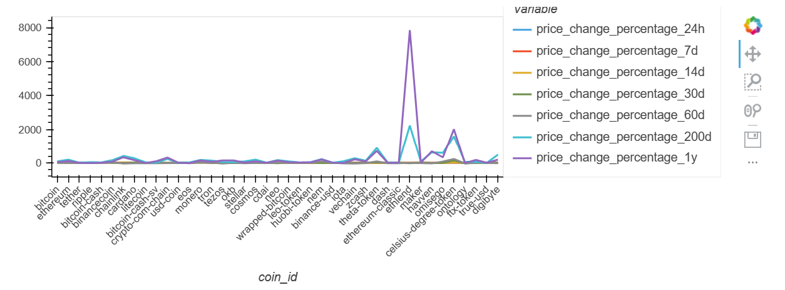
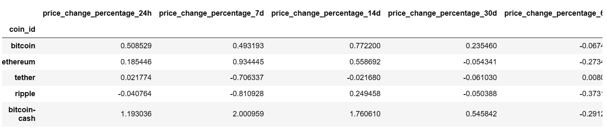
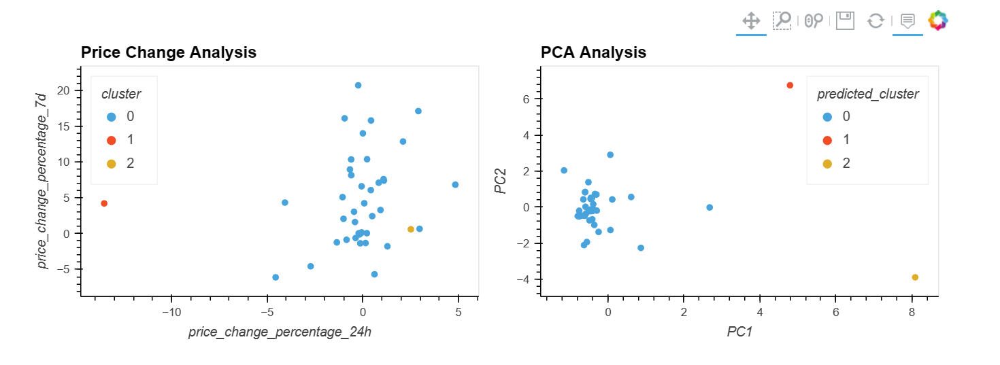
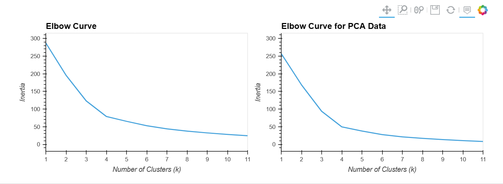

# CryptoClustering

Use your knowledge of Python and unsupervised learning to predict if cryptocurrencies are affected by 24-hour or 7-day price changes.

METHODS

PREPARE THE DATA

Use the StandardScaler() module from scikit-learn to normalize the data from the CSV file.

Create a DataFrame with the scaled data and set the "coin_id" index from the original DataFrame as the index for the new DataFrame.

	The first five rows of the scaled DataFrame should appear as follows:

FIND THE BEST VALUE FOR k USING THE ORIGINAL SCALED DATAFRAME

Use the elbow method to find the best value for k using the following steps:

	Create a list with the number of k values from 1 to 11.

	Create an empty list to store the inertia values.

	Create a for loop to compute the inertia with each possible value of k.

	Create a dictionary with the data to plot the elbow curve.

	Plot a line chart with all the inertia values computed with the different values of k to visually identify the optimal value for k.

	Answer the following question in your notebook: What is the best value for k?

CLUSTER CRYPTOCURRENCIES WITH K-means USING THE ORIGINAL SCALED DATA

Use the following steps to cluster the cryptocurrencies for the best value for k on the original scaled data:

	Initialize the K-means model with the best value for k.

	Fit the K-means model using the original scaled DataFrame.

	Predict the clusters to group the cryptocurrencies using the original scaled DataFrame.

	Create a copy of the original data and add a new column with the predicted clusters.

	Create a scatter plot using hvPlot as follows:

		Set the x-axis as "price_change_percentage_24h" and the y-axis as "price_change_percentage_7d".
		Color the graph points with the labels found using K-means.
		Add the "coin_id" column in the hover_cols parameter to identify the cryptocurrency represented by each data point.

OPTIMIZE CLUSTERS WITH PRINCIPAL COMPONENT ANALYSIS

	Using the original scaled DataFrame, perform a PCA and reduce the features to three principal components.

	Retrieve the explained variance to determine how much information can be attributed to each principal component and then answer the following question in your notebook:

		What is the total explained variance of the three principal components?

	Create a new DataFrame with the PCA data and set the "coin_id" index from the original DataFrame as the index for the new DataFrame.

		The first five rows of the PCA DataFrame should appear as follow:
		
		

		

FIND THE BEST VALUE FOR k USING THE PCA DATA

Use the elbow method on the PCA data to find the best value for k using the following steps:

	Create a list with the number of k-values from 1 to 11.

	Create an empty list to store the inertia values.

	Create a for loop to compute the inertia with each possible value of k.

	Create a dictionary with the data to plot the Elbow curve.

	Plot a line chart with all the inertia values computed with the different values of k to visually identify the optimal value for k.

	Answer the following question in your notebook:

		What is the best value for k when using the PCA data?

		Does it differ from the best k value found using the original data?

CLUSTER CRYPTOCURRENCIES WITH K-means USING THE PCA DATA

Use the following steps to cluster the cryptocurrencies for the best value for k on the PCA data:

	Initialize the K-means model with the best value for k.

	Fit the K-means model using the PCA data.

	Predict the clusters to group the cryptocurrencies using the PCA data.

	Create a copy of the DataFrame with the PCA data and add a new column to store the predicted clusters.

	Create a scatter plot using hvPlot as follows:

		Set the x-axis as "price_change_percentage_24h" and the y-axis as "price_change_percentage_7d".

		Color the graph points with the labels found using K-means.

		Add the "coin_id" column in the hover_cols parameter to identify the cryptocurrency represented by each data point.

	Answer the following question:

		What is the impact of using fewer features to cluster the data using K-Means?

RESULTS

Interpretation

Based on the information provided, the same dataset was used for both the K-means algorithm and the PCA and K-means algorithm combination. The K-means algorithm was applied to the dataset to partition it into K clusters based on similarity of the data points. Then, the PCA algorithm was applied to the dataset to reduce the dimensionality of the dataset, and the K-means algorithm was applied again to the reduced dataset to partition it into K clusters.

The Inertia, Dunn Index, Silhouette Score, and Calinski-Harabasz Index  metrics were used to evaluate the quality of clustering results (see Crypto_Clustering.ipynb,"Evaluate the quality of the clustering results").

The Silhouette Score measures the compactness and separation of the clusters, with a score ranging from -1 to 1. A score closer to 1 indicates better clustering performance. In this case, both algorithms achieved a Silhouette Score of 70% and 74%, respectively, which suggests good performance in clustering. However, the PCA and K-means combination solution had a slightly higher score, indicating better separation and compactness of the clusters.

The Inertia measures the within-cluster sum of squared distances from each point to its centroid. A lower value indicates better clustering performance. In this case, the PCA and K-means combination algorithm achieved a lower Inertia value of 93.77, compared to 123.19 the K-means algorithm alone. This suggests that the PCA and K-means algorithm combination was able to create more compact clusters.

The Calinski-Harabasz Index measures the ratio of between-cluster variance to within-cluster variance. A higher value indicates better clustering performance. In this case, the PCA and K-means algorithm combination achieved a higher CH Index score of 33.05, compared to 25.26 to the other one. This suggests that the PCA and K-means combination algorithm was able to create more separated clusters.

Overall, it appears that both algorithms performed well in clustering, but PCA and K-means algorithm combination had slightly better performance, with better separation and compactness of the clusters. The k value of 3 was used for both algorithms, and it seems to have resulted in well-separated and compact clusters.
